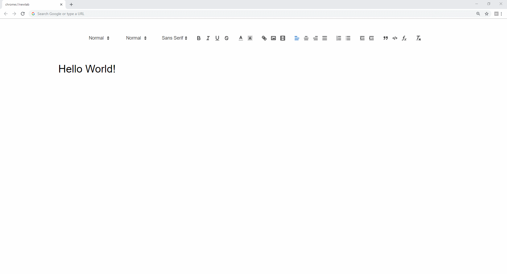

<h1 align="center">
  
  <strong>markup</strong>
</h1>

A Google Chrome extension that replaces new tabs with a text editor.   Built with <a href="https://quilljs.com/">quill.js</a>.

<figure>
  
  <figcaption>
<a href="./">demo</a>
</figcaption>
</figure>

### Features

- standard text editor

- code-fencing and inline math

- Markdown and Emoji shortcuts

### Installation

0. Clone this repo.

1. Go to `chrome://extensions/` via the address bar.

2. Enable `developer mode` by clicking the toggle switch on the top right.

3. Click `load unpacked` and select the *internal* `markup` folder.

### Usage

- Works offline, but...

- Everything is stored in the browser cache. All notes will be deleted if `cached images and files` is cleared.

### Modules

- [quill-emoji](https://github.com/contentco/quill-emoji)
- [quill-image-resize-module](https://github.com/kensnyder/quill-image-resize-module)
- [quill-magic-url](https://github.com/visualjerk/quill-magic-url)
- [quill-markdown-shortcuts](https://github.com/patleeman/quill-markdown-shortcuts)
